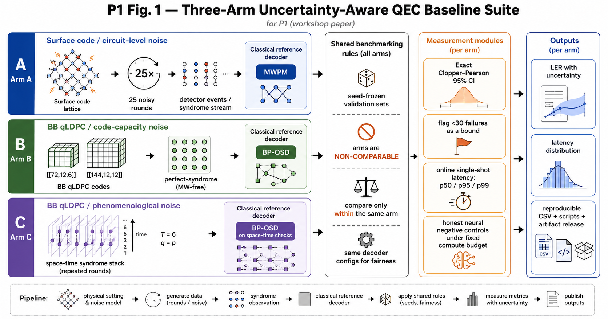

# Measure the baseline before you beat it



**Our reference decoder made zero mistakes in 100,000 trials. That is not a logical
error rate of zero — it is the statement "below 3.69e-5", and nothing more. And the
decoder whose median decode takes 121 microseconds takes 3,179 microseconds one shot
in a hundred. Neither fact is visible in the way classical baselines are usually
reported.**

This repository is the artifact for the short paper *Measure the Baseline Before You Beat
It: A Reproducible, Confidence-Interval-Grounded Suite of Classical Quantum-Error-Correction
Decoders* (Woncheol Jeong and Hayoung Oh, Sungkyunkwan University), accepted at the AI for
Science workshop (NeurIPS 2026). It proposes no
decoder. It publishes the measurement that learned-decoder papers are implicitly
comparing against, with the error bars and the timing methodology made explicit.

---

## The short version

When a paper claims a learned decoder beats the classical baseline, three reporting
habits make that comparison look more decisive than it is:

1. **The baseline is a bare point estimate.** A logical error rate of `6e-5` from
   6 failures in 100,000 shots is quoted as if it were a number. Its exact 95%
   binomial interval is `[2.2e-5, 1.31e-4]` — a factor of six wide. Beating `6e-5`
   is not the same as beating that interval.
2. **Latency is reported as batch throughput.** Batch decoding amortises per-call
   overhead and keeps caches warm. A real-time decoder receives the syndrome stream
   *one frame at a time*, and the online tail can be twenty-six times the median.
3. **Logical error rates from different noise models get plotted on one axis.**
   A code-capacity `p = 0.02`, a phenomenological `p = q = 0.02`, and a circuit-level
   `p = 0.02` are three different physical claims. The numeral is shared; nothing
   else is.

We fix all three, on one frozen dataset, with public tools, and publish the result.

## The three arms, which are deliberately not comparable

The separation **is** the contribution. These are never merged onto a shared axis.

| Arm | Code | Decoder | Noise model | Shots |
|---|---|---|---|---|
| **A** | rotated surface, `d = 5,7,9,11` | MWPM (`pymatching`) on the Stim detector-error model | circuit-level depolarizing, 25 rounds, `p = 1e-3` | 100,000 |
| **B** | bivariate-bicycle `[[72,12,6]]`, `[[144,12,12]]` | BP-OSD (`ldpc`) | code-capacity, perfect single-shot syndrome | 50,000 |
| **C** | `[[72,12,6]]` only (no `[[144,12,12]]` results reported) | BP-OSD over the space-time `H_st` | phenomenological, `T = 6` noisy rounds, `q = p` | 2,000 |

MWPM is the standard strong graphlike reference for the surface code (its detector error
model decomposes into graphlike edges); it cannot be applied directly to the BB check
matrices, where each qubit is in three checks. There is no single classical baseline
spanning the arms — each arm has its own bar. See [`docs/p1_arms.md`](docs/p1_arms.md)
for the four reasons the arms cannot be pooled and the rules any cross-family claim
must follow.

## What the measurement shows

**Arm A — MWPM, surface code, circuit-level, `p = 1e-3`.** Exact Clopper–Pearson 95%
intervals on every point:

| `d` | failures / shots | LER | 95% interval | status |
|---|---|---|---|---|
| 5 | 78 / 100,000 | 7.80e-4 | [6.17e-4, 9.73e-4] | resolved (−21% / +25%) |
| 7 | 6 / 100,000 | <= 1.31e-4 | [2.20e-5, 1.31e-4] | **under-resolved** |
| 9 | 3 / 100,000 | <= 8.77e-5 | [6.19e-6, 8.77e-5] | **under-resolved** |
| 11 | 0 / 100,000 | <= 3.69e-5 | [0, 3.69e-5] | **no failures** |

Only `d = 5` is a resolved measurement. Points with fewer than 30 failures are reported by
their 95% upper limit; `d = 11` (zero failures) supports only `LER <= 3.69e-5`.

**Arm B — BP-OSD, BB codes, code-capacity.** The rare-event point is the instructive
one: `[[144,12,12]]` at `p = 0.02` saw **2 failures in 50,000 shots**. The interval is
`[4.84e-6, 1.44e-4]` — the endpoints differ by a factor of ~30, about 1.5 decades. It is
reported as `LER <= 1.44e-4` (its 95% upper limit); the ratio 2/50,000 = 4.0e-5 is not
resolved. A claim that another decoder *differs* from BP-OSD here needs an interval
disjoint from this one (50 failures in 50,000 shots would give one, with a lower limit
above 1.44e-4); a claim that it *matches* BP-OSD needs an equivalence criterion, which
overlapping intervals alone do not provide.

**Arm C — BP-OSD, `[[72,12,6]]`, phenomenological, `T = 6`.** Logical error rate rises
from 0.0530 at `p = 0.02` to 0.4745, 0.9215 and 0.9955 at `p = 0.04/0.06/0.08`, a steep
rise for this one code and round count (no threshold is estimated). The same nominal
`p = 0.02` means different noise in the two BB arms: Arm C adds measurement errors and six
noisy rounds, so its LER (5.30e-2) is higher than Arm B's (8.78e-3) on the same code. That
reflects the noise model, not a verdict about the decoder.

**Online latency — the most quotable result.** Every call timed individually with
`perf_counter`, one syndrome frame in, one correction out:

| Decoder / arm | p50 | p95 | p99 | p99/p50 |
|---|---|---|---|---|
| MWPM, surface `d = 7` (25-round frame) | 10.3 us | 15.2 us | 19.5 us | 1.9 |
| MWPM, surface `d = 11` | 22.0 us | 30.3 us | 37.1 us | 1.7 |
| BP-OSD, bb72 code-capacity | 8.1 us | 12.4 us | 21.9 us | 2.7 |
| BP-OSD, bb144 code-capacity | 15.9 us | 29.3 us | 40.0 us | 2.5 |
| **BP-OSD, bb72 phenomenological** | **120.9 us** | **2933 us** | **3179 us** | **~26** |

Surface rows at `p = 1e-3`; BB rows at `p = 0.02` (phenomenological: `p = q = 0.02`, `T = 6`);
3,000 timed calls per row (2,000 for the phenomenological row), after 100 warm-up calls.

MWPM's distribution is tight. BP-OSD over the space-time graph has a heavy right tail
driven by the OSD fallback firing on hard syndromes. A later check
(`code/diag_osd_convergence.py`, receipt in `results/verification_20261006/`) records whether
belief propagation converged on each call (ldpc runs OSD only when it does not): it failed to
converge on 139 of the 2,000 phenomenological frames, and every call in the slowest 5% was one
of them; on the code-capacity frames it failed on only 10 (bb72) and 3 (bb144) of 3,000. A
throughput number divides total time by shots, which gives the mean: for the
phenomenological decoder the mean call takes 341 us, 2.8 times its median, and the tail
itself does not appear. Tail percentiles characterize the risk of missing a per-frame
deadline; whether a decoder keeps up with a stream also depends on the arrival rate,
buffering and parallelism. All times describe this Python implementation on one shared CPU.

## The negative result, stated plainly

Two learned decoders were trained and are included as **negative controls**, not as
competitive decoders:

| Model | Arm | Learned LER | Reference LER | Gap |
|---|---|---|---|---|
| Code-blind MLP | A: surface `d = 5` | 8.27e-2 | MWPM 7.0e-4 (same 20,000 shots) | **~118x worse** |
| Code-blind DeltaNet-style mixer | B: bb72, `p = 0.04` | 0.501 † | BP-OSD 7.94e-2 | **~6x worse** † |

The MLP (120 s of training on 80,000 shots of the frozen `d = 5` set) was scored on the
remaining 20,000 shots. Its recorded LER corresponds to 1,653 failures (95% interval
[7.89e-2, 8.66e-2]). On those same shots MWPM fails 14 times (7.0e-4; under-resolved, so
`<= 1.17e-3` by the reading rule), so the intervals are disjoint and the ~118x ratio of point
estimates is indicative; on all 100,000 shots MWPM gives 7.80e-4 (unpaired). Always
predicting "no flip" gives 0.209, so the MLP learned something but stays about two orders of
magnitude behind MWPM. The mixer (300 s on 200,000 freshly sampled shots) has a mean per-logical-bit
accuracy of about 0.86 and gets the full 12-bit logical-flip vector wrong on about half of the
shots. † That run recorded its LER (0.50105) but not the shots it was scored on; 0.50105 is not
a multiple of 1/50,000, so it was not scored on the whole frozen set, and the ratio is
indicative only. Neither run saved weights, so neither is bit-reproducible. Both ingest the
syndrome as a bare bit vector with no Tanner-graph or geometric structure. **This paper
makes no competitive-decoder claim.** They are here because "a code-blind sequence
mixer fails" is a useful floor, and because the honest thing to do with a losing model
is publish the loss. [`docs/p1_neural_gap.md`](docs/p1_neural_gap.md) lists hypotheses for
the gap and candidate directions (code-structured architectures, larger training budgets);
no ablations were run, so these are hypotheses and rough estimates, not results.

## What is in this repository

| path | contents |
|---|---|
| `code/prepare*.py` | frozen data generation — Stim surface circuits, BB code construction, space-time `H_st` |
| `code/baseline_*.py` | the three reference decoders (MWPM, BP-OSD, BP-OSD space-time) |
| `code/p1_intervals.py` | exact Clopper–Pearson intervals over the frozen result CSVs; no decode re-run |
| `code/p1_latency.py` | online single-shot latency, timed one call at a time |
| `code/train.py`, `code/neural_bposd_bonus.py` | the two negative controls |
| `code/verify_redecode.py` | re-decodes the shipped validation arrays and recomputes all 16 failure counts and exact intervals (about one minute on a CPU) |
| `code/diag_osd_convergence.py` | re-times BP-OSD calls and records whether BP converged (the OSD-tail mechanism check) |
| `data/frozen_validation/` | the 17 exact validation arrays behind every count and latency, with `SHA256SUMS` |
| `results/verification_20261006/` | re-decode and convergence receipts, with the package versions used |
| `results/` | every frozen CSV, plus the interval summary and the latency note |
| `docs/` | arm separation, phenomenological BB specification, honest neural-gap assessment |

```bash
pip install stim pymatching ldpc numpy scipy matplotlib   # tested: stim 1.16.0, pymatching 2.4.0, ldpc 2.4.1

# 1. Reproduce every reported failure count and interval from the shipped arrays (CPU, ~1 min):
python code/verify_redecode.py

# 2. Re-run the reported configurations through the original scripts on the shipped arrays
#    (the scripts read ~/.cache/ququ_p1_qec and write to results/; set P1_RESULT_DIR to keep a copy):
mkdir -p ~/.cache/ququ_p1_qec && cp data/frozen_validation/*.npz ~/.cache/ququ_p1_qec/
python code/baseline_mwpm.py                             # Arm A: d = 5, 7, 9, 11; 100,000 shots
python code/baseline_bposd.py                            # Arm B: bb72 and bb144; 4 values of p; 50,000 shots
python code/baseline_bposd_phenom.py bb72 --shots 2000   # Arm C as reported: bb72 only, T = 6, 2,000 shots
python code/p1_intervals.py                              # exact intervals over the result CSVs
python code/p1_latency.py                                # online latency (re-measured; varies by machine)
python code/plot_p1_rerun.py                             # Figure 2 (PDF + PNG) from the result CSVs
```

Without the shipped arrays, the same commands draw new validation sets from the seeds. Stim's
seeded sampling differs across Stim versions, so the Arm A counts can then differ. The
phenomenological script's defaults (bb72 and bb144, 20,000 shots) are a different, larger
configuration; no bb144 phenomenological results are reported.

**Data provenance.** All data is synthetic and generated by public tools. Seeds are
pinned: Stim's sampler seed `20260708` for Arm A, NumPy seeds `20260708` for Arm B and
`20260709` for Arm C. Stim's seeded sampling is not consistent across Stim versions, so the
exact arrays are shipped in `data/frozen_validation/`; re-decoding them with stim 1.16.0,
pymatching 2.4.0 and ldpc 2.4.1 reproduces all 16 failure counts exactly. BB codes use `A = x^3 + y + y^2`, `B = y^3 + x + x^2`. BP-OSD runs
min-sum with scaling 0.625, serial schedule, `max_iter = 50`, OSD combination-sweep at
order 7.

## Honest limitations

- **There is no circuit-level BB arm.** Surface is measured at circuit level; BB only
  at code-capacity and phenomenological. This is the single largest apples-to-oranges
  risk in the paper, and the surface result must not be read as standing in for
  "circuit-level qLDPC".
- **BB code distances (6 and 12) are literature values** from Bravyi et al. (*Nature*
  627, 2024) for these exact polynomials. They are **not** recomputed here; computing
  the true minimum-weight logical needs an ILP/GAP search we did not run.
- **Latency is single-threaded Python wall-clock on one shared CPU.** The numbers and the
  tail shape describe this implementation; an optimized C++/FPGA deployment must be
  measured under matched settings, and both its absolute times and its tail shape may differ.
- **The rare-event points are under-resolved by design of the shot budget**, not by
  accident, and are reported by their 95% upper limits. For the nonzero points (surface
  `d = 7, 9`; bb144 at `p = 0.02`), about 100 failures (a ~10% relative standard error; the
  95% interval then still spans about −19% to +22%) would need roughly 1.7–3.3 million
  shots. The zero-failure `d = 11` point supports only an upper limit.
- **Arm C covers one code.** Only `[[72,12,6]]` is reported under phenomenological noise;
  the code supports `[[144,12,12]]` with `T = 12`, but no such results are reported.
- **The learned decoders are negative controls only.** No comparison in this repository
  supports any claim that a neural decoder is competitive with MWPM or BP-OSD. Both are
  single runs without saved weights, and the mixer run did not record which shots it was
  scored on.

## Citation

```bibtex
@inproceedings{jeong2026measure,
  title     = {Measure the Baseline Before You Beat It: A Reproducible, Confidence-Interval-Grounded
               Suite of Classical Quantum-Error-Correction Decoders},
  author    = {Jeong, Woncheol and Oh, Hayoung},
  booktitle = {AI for Science Workshop at NeurIPS 2026},
  year      = {2026},
  note      = {Non-archival}
}
```

## License

MIT — see [LICENSE](LICENSE).
