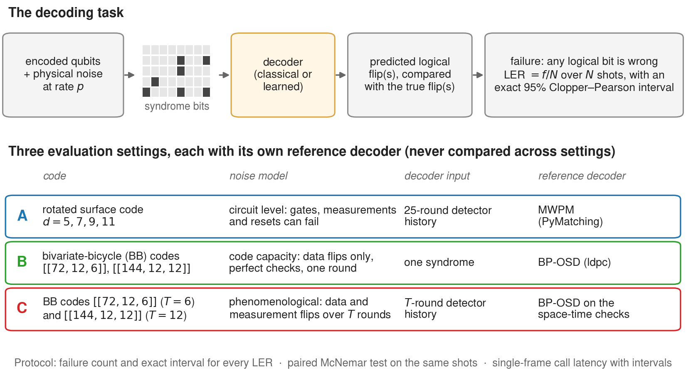

# Measure the baseline before you beat it



Classical reference measurements for quantum error-correction (QEC) decoders: minimum-weight perfect matching (MWPM)
for the rotated surface code, and belief propagation with ordered-statistics decoding (BP-OSD) for bivariate-bicycle
(BB) codes, in three separately evaluated settings.

- Every logical error rate (LER) comes with its failure count and an exact 95% Clopper–Pearson interval.
- Two decoders scored on the same shots are compared with an exact paired (McNemar) test.
- Decoding time is reported as single-frame call latency over repeated sessions.
- The frozen per-shot validation sets are included, with a harness that scores any decoder against these references.

This repository is the artifact for *Measure the Baseline Before You Beat It: A Reproducible,
Confidence-Interval-Grounded Suite of Classical Quantum-Error-Correction Decoders* (Woncheol Jeong and Hayoung Oh,
Sungkyunkwan University), accepted at the AI for Science workshop (NeurIPS 2026). It proposes no decoder.

## Three pitfalls this suite addresses

A comparison between a learned and a classical decoder can look more decisive than it is:

1. **An LER estimated from a handful of failures is uncertain.** 6 failures in 100,000 shots give 6.00e-5, but the
   exact 95% interval is [2.20e-5, 1.31e-4], a factor of six wide.
2. **Batch throughput hides how long single calls take.** The phenomenological BP-OSD decoder below has a median call
   time of 125 us and a p99 of 3,800 us.
3. **The same numerical `p` describes different noise under different noise models.** A code-capacity `p = 0.02`, a
   phenomenological `p = q = 0.02` and a circuit-level `p = 0.02` are different fault processes, so their LERs are not
   comparable.

## The three settings ("arms")

| | Arm A | Arm B | Arm C |
|---|---|---|---|
| code | rotated surface code, `d = 5, 7, 9, 11` | BB `[[72,12,6]]`, `[[144,12,12]]` | BB `[[72,12,6]]` (`T = 6`), `[[144,12,12]]` (`T = 12`) |
| noise | circuit level (Stim), 25 rounds | code capacity | phenomenological: `T` noisy rounds (data `p`, check outcomes `q = p`) and one perfect readout |
| decoder input | 25 rounds of detection events | one syndrome | `T + 1` rounds of detection events |
| failure | the observable is predicted wrongly | any of the 12 logical bits is wrong | any of the 12 logical bits is wrong |
| reference | MWPM (PyMatching) on the detector error model | BP-OSD (`ldpc`) | BP-OSD on the space-time check matrix |
| `p` values | 1, 2, 3, 5 x 1e-3 | 0.02–0.08 | 0.002–0.08 |

LERs are never compared across arms. BP-OSD is configured the same way in Arms B and C:
- min-sum BP with scaling 0.625;
- serial schedule;
- at most 50 iterations;
- OSD combination sweep of order 7.

Both BB arms decode X errors with the Z checks. MWPM is the standard reference for the surface code, whose detector
error model decomposes into graphlike edges. It cannot be applied directly to the BB check matrices, where each qubit is
in three checks. [`docs/p1_arms.md`](docs/p1_arms.md) gives the reasons the arms cannot be pooled.

## Results

Two kinds of data are used, and they are never pooled:
- **Frozen validation sets** of the original study (2026-07). These are shipped as arrays in `data/frozen_validation/`,
  because Stim's seeded sampling is not consistent across Stim versions. Any decoder can be scored on exactly these
  shots.
- **Fixed-sample runs** in `results/v3/`. These draw fresh shots from new seeds. The number of shots per configuration
  was fixed in a protocol frozen before any run: [`docs/fixed_sample_protocol.md`](docs/fixed_sample_protocol.md).

Reporting rules:
- Every point is `f/N` with the exact two-sided, equal-tailed 95% Clopper–Pearson interval.
- Points with fewer than 30 failures are flagged as low-count. They are still valid estimates, but conclusions rest on
  their intervals.
- A zero-failure point is reported by its interval's upper end. For `N = 100,000` that is 3.69e-5; the one-sided 95%
  limit would be 3.00e-5.
- About 100 failures give a relative standard error of about 10%; the 95% interval then spans about -19% to +22%.
- Intervals are pointwise, not simultaneous over a sweep.

### Arm A: surface code, MWPM, circuit-level noise (fixed-sample runs)

| `p` | `d` | failures / shots | LER | 95% interval | flag |
|---|---|---|---|---|---|
| 0.001 | 5 | 154 / 200,000 | 7.7e-4 | [6.5e-4, 9.0e-4] |  |
| 0.001 | 7 | 145 / 2,000,000 | 7.3e-5 | [6.1e-5, 8.5e-5] |  |
| 0.001 | 9 | 27 / 4,000,000 | 6.8e-6 | [4.4e-6, 9.8e-6] | low count |
| 0.001 | 11 | 3 / 10,000,000 | 3.0e-7 | [6.2e-8, 8.8e-7] | low count |
| 0.002 | 5 | 561 / 100,000 | 5.6e-3 | [5.2e-3, 6.1e-3] |  |
| 0.002 | 7 | 101 / 100,000 | 1.0e-3 | [8.2e-4, 1.2e-3] |  |
| 0.002 | 9 | 233 / 1,000,000 | 2.3e-4 | [2.0e-4, 2.6e-4] |  |
| 0.002 | 11 | 144 / 4,000,000 | 3.6e-5 | [3.0e-5, 4.2e-5] |  |
| 0.003 | 5 | 1,793 / 100,000 | 0.018 | [0.017, 0.019] |  |
| 0.003 | 7 | 534 / 100,000 | 5.3e-3 | [4.9e-3, 5.8e-3] |  |
| 0.003 | 9 | 171 / 100,000 | 1.7e-3 | [1.5e-3, 2.0e-3] |  |
| 0.003 | 11 | 576 / 1,000,000 | 5.8e-4 | [5.3e-4, 6.3e-4] |  |
| 0.005 | 5 | 6,988 / 100,000 | 0.070 | [0.068, 0.071] |  |
| 0.005 | 7 | 3,897 / 100,000 | 0.039 | [0.038, 0.040] |  |
| 0.005 | 9 | 2,169 / 100,000 | 0.022 | [0.021, 0.023] |  |
| 0.005 | 11 | 1,223 / 100,000 | 0.012 | [0.012, 0.013] |  |

The LER falls with distance at every sampled `p`. No threshold is estimated.

### Arm B: BB codes, BP-OSD, code capacity

In the frozen sets (below), every point has at least 30 failures except `[[144,12,12]]` at `p = 0.02`, which had 2
failures in 50,000 shots.
The fixed-sample run gives 266 / 3,000,000 = 8.9e-5, 95% interval [7.8e-5, 1.0e-4].

### Arm C: BB codes, BP-OSD, phenomenological noise (fixed-sample runs)

| code | `T` | `p = q` | failures / shots | LER | 95% interval | flag |
|---|---|---|---|---|---|---|
| `[[72,12,6]]` | 6 | 0.002 | 33 / 1,000,000 | 3.3e-5 | [2.3e-5, 4.6e-5] |  |
| `[[72,12,6]]` | 6 | 0.005 | 136 / 200,000 | 6.8e-4 | [5.7e-4, 8.0e-4] |  |
| `[[72,12,6]]` | 6 | 0.01 | 293 / 50,000 | 5.9e-3 | [5.2e-3, 6.6e-3] |  |
| `[[72,12,6]]` | 6 | 0.015 | 454 / 20,000 | 0.023 | [0.021, 0.025] |  |
| `[[72,12,6]]` | 6 | 0.02 | 1,093 / 20,000 | 0.055 | [0.052, 0.058] |  |
| `[[144,12,12]]` | 12 | 0.005 | 0 / 200,000 | <= 1.8e-5 | [0, 1.8e-5] | no failures |
| `[[144,12,12]]` | 12 | 0.01 | 3 / 200,000 | 1.5e-5 | [3.1e-6, 4.4e-5] | low count |
| `[[144,12,12]]` | 12 | 0.02 | 88 / 50,000 | 1.8e-3 | [1.4e-3, 2.2e-3] |  |

The two codes differ in size and in round count, so the difference between them is described, not attributed.

### Paired comparison of BP-OSD variants (`results/v3/paired_tests.csv`)

The variants of a setting decode identical frames, because they share one seed.
- `b` counts shots where the variant fails and the reference (OSD combination sweep of order 7) succeeds; `c` counts
  the reverse.
- The p-values come from an exact McNemar test, Holm-adjusted over the six tests.

| setting | variant | shots | reference fails | variant fails | `b` | `c` | Holm-adjusted p |
|---|---|---|---|---|---|---|---|
| B: `[[72,12,6]]`, `p = 0.04` | OSD-0 | 100,000 | 7,932 | 7,967 | 41 | 6 | 3.5e-7 |
| B: `[[72,12,6]]`, `p = 0.04` | BP only | 100,000 | 7,932 | 8,765 | 909 | 76 | < 1e-15 |
| C: `[[72,12,6]]`, `T = 6`, `p = 0.01` | OSD-0 | 50,000 | 326 | 330 | 4 | 0 | 0.13 |
| C: `[[72,12,6]]`, `T = 6`, `p = 0.01` | BP only | 50,000 | 326 | 391 | 71 | 6 | 1.4e-14 |
| C: `[[72,12,6]]`, `T = 6`, `p = 0.02` | OSD-0 | 20,000 | 1,108 | 1,149 | 45 | 4 | 2.5e-9 |
| C: `[[72,12,6]]`, `T = 6`, `p = 0.02` | BP only | 20,000 | 1,108 | 1,651 | 555 | 12 | < 1e-15 |

On Arm B at `p = 0.04`, OSD-0 and the reference fail on almost the same number of shots, and their marginal intervals
overlap almost entirely. Yet OSD-0 alone fails on 41 shots and the reference alone on 6.

### Single-frame call latency (`results/v3/latency_sessions.csv`)

Each configuration ran in five sessions. A session is a fresh process pinned to one core of a shared server CPU
(INTEL XEON SILVER 4510): 500 untimed warm-up calls, then 10,000 timed calls of one frame each. The table gives the median over sessions
and the range across sessions. Absolute values are specific to this host and its load.

| arm: decoder, setting (frame) | p50 (us) | range | p99 (us) | range | BP not converged |
|---|---|---|---|---|---|
| A: MWPM, `d = 7`, `p = 1e-3` (25-round frame) | 11 | [11, 12] | 27 | [26, 29] |  |
| A: MWPM, `d = 11`, `p = 1e-3` (25-round frame) | 22 | [20, 29] | 48 | [33, 58] |  |
| B: BP-OSD, `[[72,12,6]]`, `p = 0.02` (syndrome) | 8 | [8, 11] | 30 | [22, 33] | 0.3% |
| B: BP-OSD, `[[144,12,12]]`, `p = 0.02` (syndrome) | 20 | [16, 21] | 49 | [42, 50] | 0.1% |
| C: BP-OSD, `[[72,12,6]]`, `p = 0.005` (6-round frame) | 71 | [69, 97] | 189 | [123, 215] | 0.0% |
| C: BP-OSD, `[[72,12,6]]`, `p = 0.02` (6-round frame) | 125 | [119, 129] | 3,800 | [3,290, 4,258] | 6.7% |
| C: BP-OSD-0, `[[72,12,6]]`, `p = 0.02` | 129 | [118, 130] | 2,077 | [1,505, 2,162] | 6.9% |
| C: BP only, `[[72,12,6]]`, `p = 0.02` | 127 | [111, 144] | 1,852 | [1,364, 2,028] | 6.9% |
| C: BP-OSD, `[[144,12,12]]`, `p = 0.01` (12-round frame) | 410 | [409, 411] | 3,366 | [1,763, 26,098] | 1.0% |

- **Phenomenological `[[72,12,6]]` at `p = 0.02`.** BP failed to converge on 6.7% of frames. In every session these
  frames made up 100% of the slowest 5% of calls: a non-converged frame runs all 50 BP iterations and then OSD.
- **Phenomenological `[[144,12,12]]` at `p = 0.01`.** Every non-converged call took longer than every converged one
  (about 30 ms against at most 5.6 ms). Between 88 and 107 of the 10,000 calls in a session did not
  converge. The p99 therefore lies inside the slow group in sessions with more than 100 such calls, and below it
  otherwise.
- **What these numbers describe.** They are service times per frame. Whether a decoder meets a real-time deadline also
  depends on the arrival rate, buffering and parallelism.

The original study's single-session timings (`results/p1_latency_note.txt`, `results/exp1/p1_latency.csv` and the
`us_per_shot` columns) are superseded by these sessions.

### Frozen validation sets of the original study (2026-07)

These counts are re-derived exactly by `code/verify_redecode.py`. The `[[144,12,12]]`, `p = 0.02` point is superseded by
the fixed-sample run above, but is listed as measured.

| arm | configuration | failures / shots | LER | 95% interval | flag |
|---|---|---|---|---|---|
| A | surface `d = 5`, `p = 1e-3` | 78 / 100,000 | 7.80e-4 | [6.17e-4, 9.73e-4] |  |
| A | surface `d = 7`, `p = 1e-3` | 6 / 100,000 | 6.00e-5 | [2.20e-5, 1.31e-4] | low count |
| A | surface `d = 9`, `p = 1e-3` | 3 / 100,000 | 3.00e-5 | [6.19e-6, 8.77e-5] | low count |
| A | surface `d = 11`, `p = 1e-3` | 0 / 100,000 | <= 3.69e-5 | [0, 3.69e-5] | no failures |
| B | `[[72,12,6]]`, `p = 0.02` | 439 / 50,000 | 8.78e-3 | [7.98e-3, 9.64e-3] |  |
| B | `[[72,12,6]]`, `p = 0.04` | 3,969 / 50,000 | 0.0794 | [0.0770, 0.0818] |  |
| B | `[[72,12,6]]`, `p = 0.06` | 12,098 / 50,000 | 0.242 | [0.238, 0.246] |  |
| B | `[[72,12,6]]`, `p = 0.08` | 22,741 / 50,000 | 0.455 | [0.450, 0.459] |  |
| B | `[[144,12,12]]`, `p = 0.02` | 2 / 50,000 | 4.00e-5 | [4.84e-6, 1.44e-4] | low count |
| B | `[[144,12,12]]`, `p = 0.04` | 397 / 50,000 | 7.94e-3 | [7.18e-3, 8.76e-3] |  |
| B | `[[144,12,12]]`, `p = 0.06` | 4,003 / 50,000 | 0.0801 | [0.0777, 0.0825] |  |
| B | `[[144,12,12]]`, `p = 0.08` | 14,464 / 50,000 | 0.289 | [0.285, 0.293] |  |
| C | `[[72,12,6]]`, `T = 6`, `p = 0.02` | 106 / 2,000 | 0.0530 | [0.0436, 0.0637] |  |
| C | `[[72,12,6]]`, `T = 6`, `p = 0.04` | 949 / 2,000 | 0.475 | [0.452, 0.497] |  |
| C | `[[72,12,6]]`, `T = 6`, `p = 0.06` | 1,843 / 2,000 | 0.922 | [0.909, 0.933] |  |
| C | `[[72,12,6]]`, `T = 6`, `p = 0.08` | 1,991 / 2,000 | 0.996 | [0.991, 0.998] |  |

## Neural negative controls

Two code-blind learned decoders were trained and are reported as negative controls, not as competitive decoders:

| control | setting | recorded LER | reference |
|---|---|---|---|
| residual MLP on the flattened detection events | Arm A: `d = 5`, `p = 1e-3` | 8.27e-2 (1,653 / 20,000 held-out shots; 95% interval [7.89e-2, 8.66e-2]) | MWPM on the same shots: 14 / 20,000 = 7.0e-4 (95% interval [3.8e-4, 1.2e-3]; low count) |
| gated delta-rule sequence mixer | Arm B: `[[72,12,6]]`, `p = 0.04` | 0.50105 (the run did not record which shots it was scored on) | BP-OSD on the full frozen set: 3,969 / 50,000 = 7.94e-2 (not the same shots) |

- **The gaps.** The MLP's LER is about 118x that of MWPM on the same shots, and the mixer's about 6x that of BP-OSD.
  The second ratio is indicative only.
- **No paired test.** Both are single runs that saved neither weights nor per-shot predictions, so the paired test
  cannot be applied to them.
- **Hypotheses only.** [`docs/p1_neural_controls.md`](docs/p1_neural_controls.md) gives the records, untested
  hypotheses for the gap, and candidate routes to a competitive learned decoder.

## Scoring your own decoder

A decoder is any object with a method `decode(frame)` that returns a 1-D 0/1 array: either a physical correction or a
prediction of the logical flips. The output length tells the harness which one it is (see the docstring of
`code/harness.py`).

```python
import sys; sys.path.insert(0, "code")
import harness as H

data = H.load_frozen("B", code="bb72", p=0.04)        # a frozen set; its SHA-256 is checked on load
mine = H.score(my_decoder, data)                       # failures, shots, LER, exact 95% interval, per-shot failures
ref = H.score(H.reference_for(data), data)             # the arm's reference decoder on the same shots
print(H.fmt_result(mine))
print(H.fmt_compare(H.compare(mine["fail"], ref["fail"])))   # paired McNemar test
lat = H.latency(my_decoder.decode, data.frames[:10500])      # 500 warm-up calls, then 10,000 single-frame calls
```

- `examples/custom_decoder_template.py` is a template to copy.
- `examples/score_reference.py` checks that the harness reproduces four reference counts.
- `examples/compare_osd_orders.py` compares OSD-0 and BP alone with the reference on a frozen Arm B set, using the
  paired test.
- `code/compare.py` runs the paired test on two saved failure vectors.

Time learned decoders in the same way, one frame per call, including any host–device transfer.

## Reproducing the results

Tested with Python 3.10.12, stim 1.16.0, pymatching 2.4.0, ldpc 2.4.1 and numpy 2.2.6, on a CPU.

```bash
pip install stim==1.16.0 pymatching==2.4.0 ldpc==2.4.1 numpy scipy matplotlib pytest

python code/verify_redecode.py          # re-decode the frozen sets: all 16 failure counts and intervals
python examples/score_reference.py      # the harness reproduces four reference counts
python -m pytest -q tests/              # harness tests

# Fixed-sample runs: 34 configurations, about 2,600 CPU-seconds in total (the longest takes about 10 minutes)
python code/v3/driver.py code/v3/configs_fixed_sample.jsonl runs/main 16
# Latency sessions (Linux; pins each session to the given core; absolute times depend on the machine)
for s in 1 2 3 4 5; do python code/v3/latency_session.py $s code/v3/configs_latency.jsonl runs/latency 0; done
python code/v3/export_v3_results.py runs results/v3   # CSVs, failure vectors, paired tests, SHA256SUMS
(cd results/v3 && sha256sum -c SHA256SUMS)             # check the shipped results against their checksums
python code/v3/make_tables.py                          # every results table of the paper, from results/

python code/plot_fig2.py                # Figure 2 from results/ (PDF + PNG)
python code/make_fig1.py                # Figure 1
```

With the same package versions, re-running a fixed-sample configuration reproduces its per-shot failure vector
exactly. Stim's seeded sampling differs across Stim versions, so Arm A runs can differ under other Stim versions.

The original study's scripts produced the frozen sets and their results:

```bash
mkdir -p ~/.cache/ququ_p1_qec && cp data/frozen_validation/*.npz ~/.cache/ququ_p1_qec/
python code/baseline_mwpm.py                             # Arm A: d = 5, 7, 9, 11; 100,000 shots
python code/baseline_bposd.py                            # Arm B: bb72 and bb144; 4 values of p; 50,000 shots
python code/baseline_bposd_phenom.py bb72 --shots 2000   # Arm C frozen set: bb72, T = 6, 2,000 shots
python code/p1_intervals.py                              # exact intervals over the frozen result CSVs
```

The scripts read `~/.cache/ququ_p1_qec` and write to `results/`; set `P1_RESULT_DIR` to keep a copy. Without the shipped
arrays, they draw new validation sets from the seeds. The phenomenological script's defaults (bb72 and bb144, 20,000
shots) are a different configuration from the frozen set.

## What is in this repository

| path | contents |
|---|---|
| `code/harness.py`, `code/compare.py` | the evaluation harness (scoring, paired test, single-frame latency) and the paired-test command |
| `code/v3/` | fixed-sample runs, latency sessions, paired tests, the export to `results/v3/` and the results tables, with the frozen configuration files |
| `code/prepare*.py` | data generation: Stim surface circuits, BB code construction, the space-time check matrix |
| `code/baseline_*.py`, `code/p1_intervals.py`, `code/p1_latency.py` | the original study's reference runs, intervals and latency |
| `code/verify_redecode.py` | re-decodes the frozen sets and recomputes all 16 failure counts and intervals |
| `code/diag_osd_convergence.py` | the original study's check of BP convergence on each call |
| `code/train.py`, `code/neural_bposd_bonus.py` | the two neural negative controls |
| `code/plot_fig2.py`, `code/make_fig1.py` | the two figures |
| `data/frozen_validation/` | the 17 frozen arrays, with `SHA256SUMS` |
| `data/logicals/` | the published logical-Z bases used for scoring BB-code outputs, with `SHA256SUMS` |
| `results/v3/` | fixed-sample runs, per-shot failure vectors, paired tests, latency sessions, `SHA256SUMS` |
| `results/exp1/`, `results/exp3/`, `results/verification_20261006/` | the original study's results, and the re-decode and convergence receipts |
| `examples/`, `tests/` | harness examples and tests |
| `docs/` | arm separation, protocol of the fixed-sample runs, the phenomenological BB specification, the neural controls |

## Data provenance

All data is synthetic and generated with public tools.

| data | seeds |
|---|---|
| frozen sets | Stim sampler seed `20260708` (Arm A); NumPy seeds `20260708` (Arm B) and `20260709` (Arm C) |
| fixed-sample runs | `20261006000` to `20261006027`, listed per configuration in `code/v3/configs_fixed_sample.jsonl` |
| latency sessions | `20261006500 + 100 x session + configuration index` |

The BB codes use `A = x^3 + y + y^2` and `B = y^3 + x + x^2`, following Bravyi et al. (*Nature* 627, 2024).

## Limitations

- **No circuit-level BB setting.** The BB arms use code-capacity and phenomenological noise. A decoder that does well
  there has not been tested on circuit-level BB noise.
- **Host-specific timing.** Latency is Python-level wall-clock on one shared CPU. An optimized implementation must be
  measured under matched settings, and both its absolute times and its tail may differ.
- **Remaining low-count points.** Arm A at `d = 9` and `d = 11` (`p = 1e-3`) and Arm C `[[144,12,12]]` at low `p` have
  fewer than 30 failures (or none), even at the fixed sample sizes. They are reported as measured.
- **Simplified models.** The BB distances (6 and 12) are literature values and are not recomputed here. The
  phenomenological model omits gate-level faults.
- **Neural controls only.** Nothing in this repository supports a claim that a neural decoder is competitive with MWPM
  or BP-OSD.

## Citation

```bibtex
@inproceedings{jeong2026measure,
  title     = {Measure the Baseline Before You Beat It: A Reproducible, Confidence-Interval-Grounded
               Suite of Classical Quantum-Error-Correction Decoders},
  author    = {Jeong, Woncheol and Oh, Hayoung},
  booktitle = {AI for Science Workshop at NeurIPS 2026},
  year      = {2026},
  note      = {Non-archival}
}
```

## License

MIT — see [LICENSE](LICENSE).
